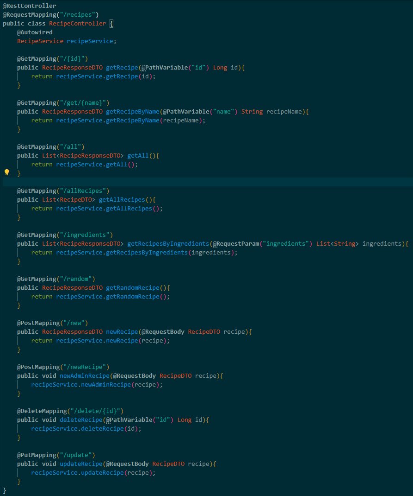

# Como En Casa

## **Índice de contenido**
  - [**Índice de contenido**](#índice-de-contenido)
  - [**Introducción**](#introducción)
  - [**Aplicación móvil**](#aplicación-móvil)
    - [*Descripción*](#descripción)
    - [*Funcionalidades*](#funcionalidades)
      - [Login del usuario](#login-del-usuario)
      - [Registro del usuario](#registro-del-usuario)
      - [Pantalla de inicio](#pantalla-de-inicio)
      - [Ver receta recomendada](#ver-receta-recomendada)
      - [Buscar receta](#buscar-receta)
      - [Ver lista de favoritos](#ver-lista-de-favoritos)
      - [Ver menú semanal](#ver-menu-semanal)
      - [Ver nevera](#ver-nevera)
      - [Ver perfil](#ver-perfil)
  - [**Aplicación de escritorio**](#aplicación-de-escritorio)
    - [*Descripción*](#descripcicón-1)
    - [*Funcionalidades*](#funcionalidades-1)
      - [Login del administrador](#login-del-administrador)
      - [Añadir receta](#añadir-receta)
      - [Modificar receta](#modificar-receta)
      - [Eliminar receta](#Eliminar-receta)
      - [Añadir ingrediente](#añadir-ingrediente)
      - [Modificar ingrediente](#modificar-ingrediente)
      - [Eliminar ingrediente](#Eliminar-ingrediente)
  - [**API**](#api)
    - [*Descripción*](#descripcicón-1)
      - [Model](#model)
      - [DTO](#dto)
      - [Repository](#repository)
      - [Service](#service)
      - [Controller](#controller)
  - [**Autores del proyecto**](#autores-del-proyecto)

## **Introducción**
*Como en casa* es un proyecto que busca acercar a la gente a la cocina casera a través de recetas sencillas, para que, de esta forma, aprendan a comer sano, rico y además a evitar el desperdicio de alimentos.

El resultado de este proyecto son dos aplicaciónes: una aplicación móvil donde un usuario podrá gestionar las recetas en su lista de favoritos, y una aplicación móvil donde los administradores podrán crear y modificar ingredientes y recetas. Todas estas gestiones se realizarán mediante una API que realizará la conexión a la base de datos.

## **Aplicación móvil**
### *Descripción*
La aplicación móvil está diseñada para Android (11 o superior), y está programada en Kotlin con Android Studio Hedgehog 2023.1.1.

### *Funcionalidades*
#### Login del usuario

El login será la primera pantalla que verá el usuario al acceder a la aplicación. El logo de Como en Casa va a encabezar esta pantalla y el usuario tendrá que indicar su correo electrónico y contraseña, y clickar en el botón *`Acceder`* para poder acceder a la [pantalla de inicio](#pantalla-de-inicio) de la aplicación.

En caso de que no esté registrado, tendrá que registrarse clickando en el botón *`Registrarse`* que le llevará a la pantalla de [registro del usuario](#registro-del-usuario).

#### Registro del usuario

Si el usuario no está registrado, deberá clickar en el botón *`Registrarse`* de la pantalla de [login del usuario](#login-del-usuario). En la pantalla de registro deberá indicar un nombre de usuario, un correo electrónico y una contraseña y, al clickar en el botón *`Registrarse`* accederá a la [pantalla de inicio](#pantalla-de-inicio) de la aplicación.

#### Pantalla de inicio

En la pantalla de inicio el usuario podrá ver en la parte superior de la pantalla un menú mediante el cual navegar entre las distintas pantallas: [lista de favoritos](#ver-lista-de-favoritos), [menú semanal](#ver-menú-semanal), [ver nevera](#ver-nevera) y [ver perfil](#ver-perfil).

Debajo de este menú se encuentra la [receta recomendada](#ver-receta-recomendada). Para acceder a ella deberá clickar en la imagen.

Por último, debajo de la [receta recomendada](#ver-receta-recomendada), el usuario tendrá la opción de [buscar receta](#buscar-receta).

A continuación se explicarán todas las pantallas antes mencionadas.

#### Ver receta recomendada
Para acceder a la receta recomendada, el usuario deberá clickar en la imagen que se encuentra en la [pantalla de inicio](#pantalla-de-inicio). En la nueva pantalla que se abre el usuario verá el nombre de la receta, la imagen de la misma, los ingredientes así como cantidades de los mismos necesarios para la receta, y una descripción de los pasos a seguir para realizarla.

Por último, el usuario tendrá un botón *`Guardar receta`* que le permitirá guardar la receta en favoritos o, *`Eliminar receta`* en caso de que ya esté, eliminarla de favoritos si no desea seguir teniendo esta receta guardada.

#### Buscar receta
*Actualmente no implementado*
Para buscar una receta en la base de datos el usuario deberá, en la [pantalla de inicio](#pantalla-de-inicio), indicar entre uno y tres ingredientes y clickar sobre el botón *`Buscar receta`*.

En la nueva pantalla que se abre se le mostrará al usuario una lista con todas las recetas que hay almacenadas en la base de datos que contengan al menos uno de los ingredientes especificados en la [pantalla de inicio](#pantalla-de-inicio).

#### Ver lista de favoritos

Para acceder a la lista de favoritos el usuario deberá clickar en el menú superior en el segundo botón llamado *`Favoritos`*. De esta manera se abrirá una pantalla con todas las recetas que el usuario tenga guardadas en su lista de favoritos.

Clickando en cualquiera de las recetas se abrirá una pantalla con el nombre de la receta, la imagen de la misma, los ingredientes así como cantidades de los mismos necesarios para la receta, y una descripción de los pasos a seguir para realizarla.

En la parte inferior se encontrará un botón, *`Eliminar receta`* en caso de que el usuario quiera eliminar dicha receta de su lista de favoritos.

#### Ver menú semanal
*Actualmente no implementado*
Para acceder al menú semanal el usuario deberá clickar en el menú superior en el botón central llamado *`Menú semanal`*.

Al hacerlo se abrirá una nueva pantalla donde el usuario podrá gestionar las recetas para configurarse su propio menú semanal.

#### Ver nevera
*Actualmente no implementado*
Para acceder a la nevera el usuario deberá clickar en el menú super en el penúltimo botón llamado *`Nevera`*.

En esta pantalla el usuario podrá agregar ingredientes a su nevera o eliminarlos, en caso de que ya no disponga de ellos.

#### Ver perfil

Para acceder a su perfil el usuario deberá clickar en el menú superior en el último botón llamado *`Perfil`*.

En la nueva pantalla que se abra el usuario podrá modificar sus datos de acceso. En caso de hacerlo, para guardar estos datos deberá pulsar en el botón *`Aceptar`*. También puede descartar dichos cambios pulsando en el botón *`Cancelar`*.

---

## **Aplicación de escritorio**
### *Descripción*
La aplicación de esctitorio está programada en C# con Visual Studio 2022.

### *Funcionalidades*

#### Login del administrador

#### Añadir receta

#### Modificar receta

#### Eliminar receta

#### Añadir ingrediente

#### Modificar ingrediente

#### Eliminar ingrediente

---

## **API**
### *Descripción*
La API está programada en lenguaje JAVA con Visual Studio Code versión 1.92.1 (user setup) y realiza la conexión con la base de datos mediante el gestor MySQL Workbecnh 8.0 CE.

#### Model

En Model se encuentran todas las clases que se van a corresponder con las entidades necesarias para crear la base de datos.

`User`:

`Recipe`:

`RecipeIngredient`:

`Ingredient`:

#### DTO

En DTO se encuentran todas las clases necesarias para transferir datos entre las capas de la aplicación, para no exponer directamente las entidades que se encuentran en Model, en las interfaces públicas.

`LoginDTO`:
Se necesita un LoginDTO porque a la hora de realizar el acceso a la aplicación, se recogerán los datos del usuario en un @Body, que contiene un DTO con únicamente los datos de acceso, lo que se traduce en el LoginDTO en la API.

`UserDTO`:

`RecipeDTO`:

`RecipeResponseDTO`:
En el caso de RecipeResponseDTO, esta clase se va a utilizar para devolver la lista de ingredientes de la receta de una forma más simplificada, en una lista de Strings.

`RecipeIngredientDTO`:

`IngredientDTO`:

#### Repository

En Repository se van a encontrar las interfaces que se encargan de la persistencia de datos.

`UserRepository`:

`RecipeRepository`:

`RecipeIngredientRepository`:

`IngredientRepository`:

#### Service

En Service se encuentran quellas clases que contienenl a lógica de negocio de la aplicación. Aquí, los servicios van a interactuar con los respositorios para realizar la persistencia de datos.

`UserService`:

`RecipeService`:

`ServiceService`:

#### Controller

El Controller va a albergar las clases que manejan las peticiones HTTP entranten. Cada controller se encargará de dirigir la petición a los servicios correspondientes.

`UserController`:

`RecipeController`:

`IngredientController`:

---

## **Autores del proyecto**
:llama: Oana Irina Cutitaru Ciobanu

:godmode: Jerónimo Ruiz Posadas
